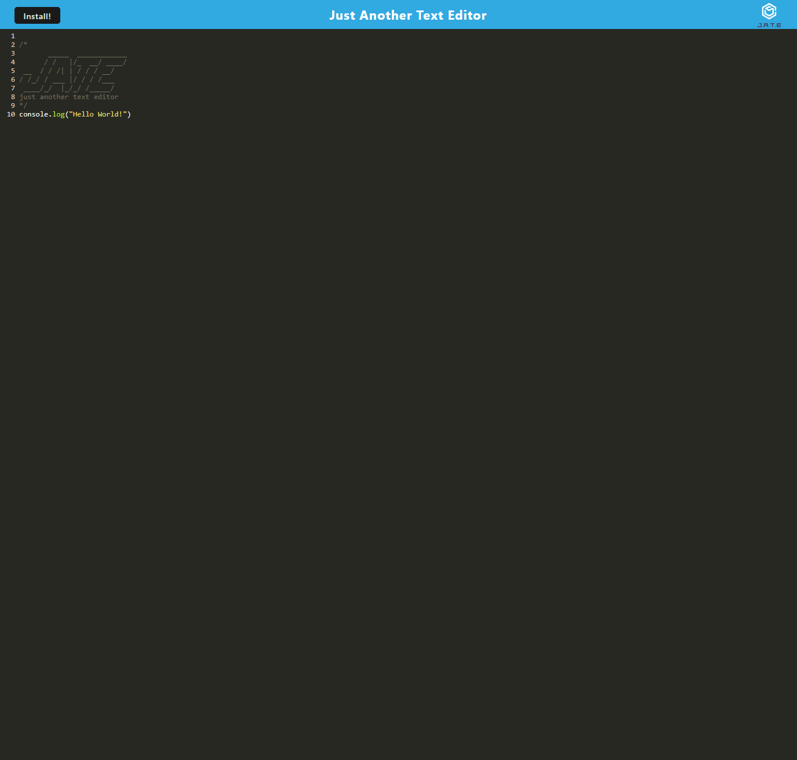

# Progress Web Applications (PWA)

## Description

The text editor PWA is a single-page application that fulfills the criteria of a Progressive Web Application. It provides an intuitive and user-friendly interface for creating, editing, and saving text documents. The application leverages data persistence techniques to ensure redundancy in case certain options are not supported by the browser. Furthermore, the text editor is designed to function offline, allowing users to continue using the application offline.

## ScreenShot

## Features

- Create new text documents
- Open existing text documents
- Save documents locally and to an indexedDB database
- Retrieves and display a llist of save documents
- Offline functionality

## Technologies

- HTML , CSS, and JavaScript for the frontend user interface
- IndexedDB database for data storage
- service worker for offline functionality and caching
- Webpack for bundling and building the application
- Heroku for deployment of the full-stack application

## Usage

1. Clone the repository to your local machine.
2. Install the project dependencies by running `npm run install` in the project root directory.
3. Build the project by running `npm run build`.
4. Start the application by running `npm run start`.

## Website

[Website Link](https://the-just-another-text-editor.herokuapp.com/)
